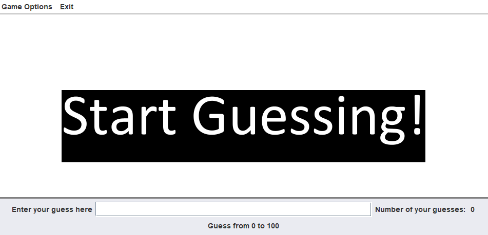
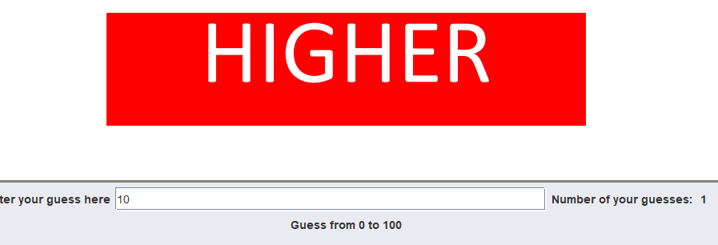
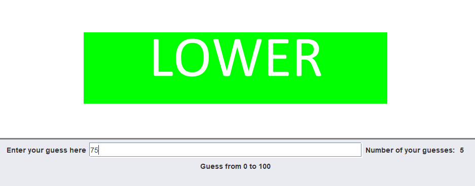
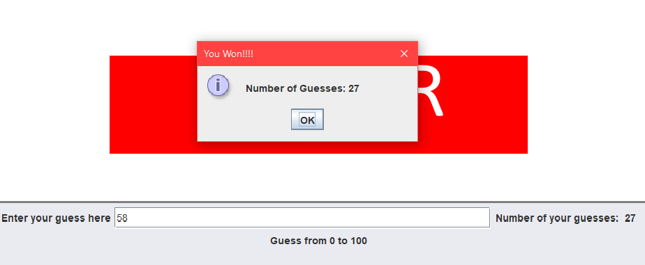

# Simple Guesser Game 

<h3 align="center">Developed By: Cloyd Van S. Secuya</h3>
<h4 align="center"><a href="https://github.com/Ciezo/Simple-Guesser-Game">Source Code</a></h4>

 

Made possible with: 

# Features
1. A simple and clean user interface
2. Restarting game session
3. Windows and notifications
4. Event driven application
5. Simple and easy to use!

<i>Start challenging yourself with this guessing game where you are presented with a goal of guessing the right number.</i> 
<i>Take a look at how many guesses it took for you to get the right generated number</i>

 
 

# Screenshots

<b>Guessed way too low? Then, try to aim higher</b>

 

<b>Ow, you aimed way higer than expected, try to going low!</b>

 

<b>There! Now, you got it just right!</b>

